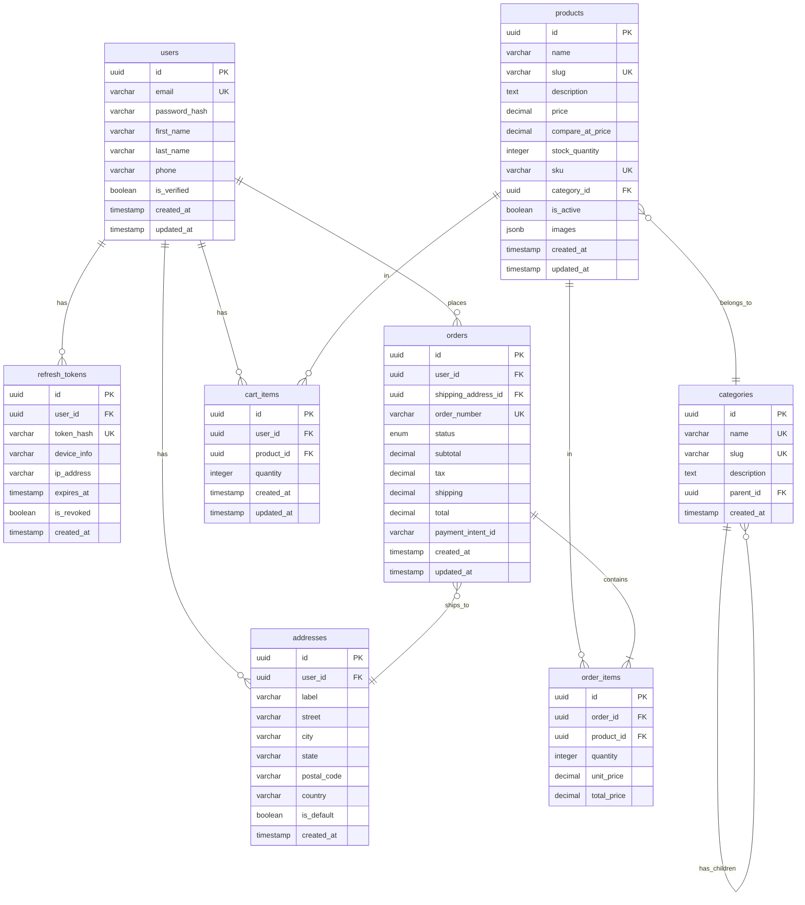

# Database Schema Documentation

Complete database schema for the Elevyn Shop ecommerce backend using Drizzle ORM with PostgreSQL.

## Entity Relationship Diagram



## Tables Overview

### users

Stores customer account information with authentication fields.

| Column        | Type         | Constraints        | Description                |
| ------------- | ------------ | ------------------ | -------------------------- |
| id            | uuid         | PK, default random | Primary key                |
| email         | varchar(255) | UNIQUE, NOT NULL   | User email address         |
| password_hash | varchar(255) | NOT NULL           | Bcrypt hashed password     |
| first_name    | varchar(100) |                    | User's first name          |
| last_name     | varchar(100) |                    | User's last name           |
| phone         | varchar(20)  |                    | Phone number               |
| is_verified   | boolean      | default false      | Email verification status  |
| created_at    | timestamp    | default now()      | Account creation timestamp |
| updated_at    | timestamp    | default now()      | Last update timestamp      |

### refresh_tokens

JWT refresh tokens for session management and multi-device support.

| Column      | Type         | Constraints   | Description             |
| ----------- | ------------ | ------------- | ----------------------- |
| id          | uuid         | PK            | Primary key             |
| user_id     | uuid         | FK → users.id | Owner of the token      |
| token_hash  | varchar(255) | UNIQUE        | Hashed refresh token    |
| device_info | varchar(255) |               | Device/browser info     |
| ip_address  | varchar(45)  |               | Client IP address       |
| expires_at  | timestamp    | NOT NULL      | Token expiration time   |
| is_revoked  | boolean      | default false | Token revocation status |
| created_at  | timestamp    | default now() | Token creation time     |

### categories

Hierarchical product categories with self-referencing parent.

| Column      | Type         | Constraints        | Description                     |
| ----------- | ------------ | ------------------ | ------------------------------- |
| id          | uuid         | PK                 | Primary key                     |
| name        | varchar(100) | UNIQUE, NOT NULL   | Category name                   |
| slug        | varchar(100) | UNIQUE, NOT NULL   | URL-friendly slug               |
| description | text         |                    | Category description            |
| parent_id   | uuid         | FK → categories.id | Parent category (for hierarchy) |
| created_at  | timestamp    | default now()      | Creation timestamp              |

### products

Product catalog with pricing, inventory tracking, and multiple images.

| Column           | Type          | Constraints        | Description            |
| ---------------- | ------------- | ------------------ | ---------------------- |
| id               | uuid          | PK                 | Primary key            |
| name             | varchar(255)  | NOT NULL           | Product name           |
| slug             | varchar(255)  | UNIQUE, NOT NULL   | URL-friendly slug      |
| description      | text          |                    | Product description    |
| price            | decimal(10,2) | NOT NULL           | Current selling price  |
| compare_at_price | decimal(10,2) |                    | Original/compare price |
| stock_quantity   | integer       | default 0          | Available inventory    |
| sku              | varchar(100)  | UNIQUE             | Stock keeping unit     |
| category_id      | uuid          | FK → categories.id | Product category       |
| is_active        | boolean       | default true       | Product visibility     |
| images           | jsonb         | default []         | Array of image URLs    |
| created_at       | timestamp     | default now()      | Creation timestamp     |
| updated_at       | timestamp     | default now()      | Last update timestamp  |

### addresses

User shipping and billing addresses.

| Column      | Type         | Constraints   | Description                |
| ----------- | ------------ | ------------- | -------------------------- |
| id          | uuid         | PK            | Primary key                |
| user_id     | uuid         | FK → users.id | Address owner              |
| label       | varchar(50)  |               | Address label (Home, Work) |
| street      | varchar(255) | NOT NULL      | Street address             |
| city        | varchar(100) | NOT NULL      | City name                  |
| state       | varchar(100) |               | State/province             |
| postal_code | varchar(20)  | NOT NULL      | Postal/ZIP code            |
| country     | varchar(100) | NOT NULL      | Country name               |
| is_default  | boolean      | default false | Default address flag       |
| created_at  | timestamp    | default now() | Creation timestamp         |

### cart_items

Shopping cart items per user (unique constraint on user+product).

| Column     | Type      | Constraints         | Description          |
| ---------- | --------- | ------------------- | -------------------- |
| id         | uuid      | PK                  | Primary key          |
| user_id    | uuid      | FK → users.id       | Cart owner           |
| product_id | uuid      | FK → products.id    | Product in cart      |
| quantity   | integer   | default 1, NOT NULL | Item quantity        |
| created_at | timestamp | default now()       | When added to cart   |
| updated_at | timestamp | default now()       | Last quantity update |

### orders

Order records with status tracking and pricing breakdown.

| Column              | Type          | Constraints       | Description               |
| ------------------- | ------------- | ----------------- | ------------------------- |
| id                  | uuid          | PK                | Primary key               |
| user_id             | uuid          | FK → users.id     | Customer who placed order |
| shipping_address_id | uuid          | FK → addresses.id | Shipping destination      |
| order_number        | varchar(50)   | UNIQUE, NOT NULL  | Human-readable order ID   |
| status              | order_status  | default 'pending' | Order status enum         |
| subtotal            | decimal(10,2) | NOT NULL          | Items subtotal            |
| tax                 | decimal(10,2) | default 0         | Tax amount                |
| shipping            | decimal(10,2) | default 0         | Shipping cost             |
| total               | decimal(10,2) | NOT NULL          | Grand total               |
| payment_intent_id   | varchar(255)  |                   | Stripe payment intent ID  |
| created_at          | timestamp     | default now()     | Order placement time      |
| updated_at          | timestamp     | default now()     | Last status update        |

**Order Status Values**: `pending`, `confirmed`, `processing`, `shipped`, `delivered`, `cancelled`, `refunded`

### order_items

Individual line items within an order.

| Column      | Type          | Constraints      | Description                     |
| ----------- | ------------- | ---------------- | ------------------------------- |
| id          | uuid          | PK               | Primary key                     |
| order_id    | uuid          | FK → orders.id   | Parent order                    |
| product_id  | uuid          | FK → products.id | Product ordered                 |
| quantity    | integer       | NOT NULL         | Quantity ordered                |
| unit_price  | decimal(10,2) | NOT NULL         | Price per unit at time of order |
| total_price | decimal(10,2) | NOT NULL         | quantity × unit_price           |

## Indexes

All tables include appropriate indexes for common query patterns:

- **Users**: Unique index on `email`
- **Refresh Tokens**: Unique index on `token_hash`, index on `user_id`
- **Categories**: Unique indexes on `name` and `slug`, index on `parent_id`
- **Products**: Unique indexes on `slug` and `sku`, indexes on `category_id` and `is_active`
- **Addresses**: Index on `user_id`
- **Cart Items**: Index on `user_id`, unique composite index on `(user_id, product_id)`
- **Orders**: Unique index on `order_number`, indexes on `user_id` and `status`
- **Order Items**: Index on `order_id`

## Usage

```typescript
import { db } from './database';
import { users, products, orders } from './database/schema';
import { eq } from 'drizzle-orm';

// Query examples
const allUsers = await db.select().from(users);
const activeProducts = await db
  .select()
  .from(products)
  .where(eq(products.isActive, true));
const userOrders = await db.query.orders.findMany({
  where: eq(orders.userId, userId),
  with: { items: true, shippingAddress: true },
});
```
